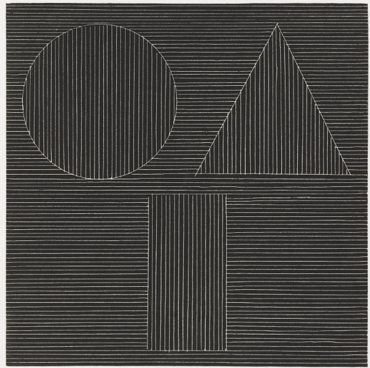

# Welcome 	

* I teach at Westinghouse College Prep in Chicago's Garfield Park neighborhood
* Texas Instruments 99/4
* born in Florida, Chicago since 1998, various places in between
* background in French Literature, Special Education, and Computer Science
* visit GWCP online at https://newwestinghouse.org
* I bounced around a little bit before becoming a teacher, including time as a dishwasher, a prep cook, five years as a cabinetmaker, and a few other things. As a teacher, I taught Special Education for thirteen years, French during one of those years, and now computer science for nine years
* Here's a work by (or based on instructions from?) Sol Lewitt. "The idea becomes a machine that makes the art." <a href="https://www.guggenheim.org/teaching-materials/singular-forms-sometimes-repeated-art-from-1951-to-the-present/sol-lewitt-1928-2007">Sol Lewitt</a>
 
<em>click the image to go to the source<em>
 

